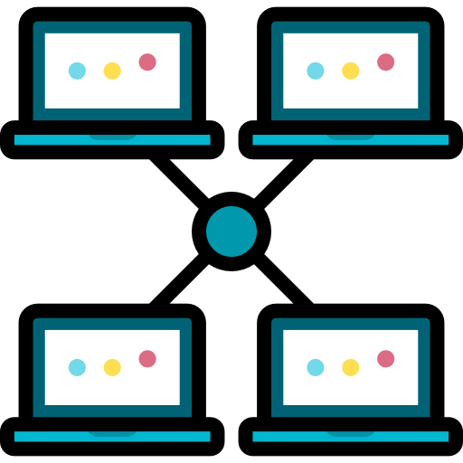

<br />
<p align="center">
  <a href="https://github.com/naderabdalghani/data-link-layer-simulation">
    
  </a>

  <h3 align="center">Data Link Layer Simulation</h3>

  <p align="center">
    An OMNeT++ implementation of the data link layer of the OSI model of computer networking
  </p>
</p>

## Table of Contents

- [About the Project](#about-the-project)
  - [Network Architecture](#network-architecture)
  - [Communication Protocol](#communication-protocol)
  - [Error Detection & Correction](#error-detection-&-correction)
  - [Data Framing](#data-framing)
  - [Transmission Channel](#transmission-channel)
  - [Built With](#built-with)
  - [Shortcomings](#shortcomings)
- [Contributors](#contributors)

## About The Project

![Network Simulation][network-simulation]

### Network Architecture

This network implementation adopts a centralized architecture where a single server node "hub" handles the communication between the rest of the nodes.

### Communication Protocol

[Selective Repeat Protocol](https://en.wikipedia.org/wiki/Selective_Repeat_ARQ) is implemented in an event-driven fashion using a predefined set of enums for the message type to ensure reliable communication.

```cpp
typedef enum
{
    tableEnum,      // From hub to nodes in initialize
    dataEnum,       // Data from another node
    nakEnum,        // Nack signal from receiver
    ackTimeOutEnum, // Ack time (receiver)
    timeOutEnum,    // Time out (sender)
    selfMsgEnum,    // From node to itself
    ackEnum,        // Ack enum
    endEnum         // End sending
} receivedMsgType;
```

This protocol uses a sliding window method for reliable delivery of data frames. It is similar to the [Go-Back-N protocol](https://en.wikipedia.org/wiki/Go-Back-N_ARQ), but not quite the same as it uses buffers and can send negative acknowledgement signals. SRP shines whenever the connection is very unreliable since retransmission is more often and frames are retransmitted selectively.

The protocol is built with the following assumptions in mind:

- Both the sender and the receiver have a window size that's less than or equal to half of the sequence number.
- Senders retransmit unacknowledged packets after a timeout period, or upon a negative acknowledgement signal.
- Receivers acknowledge all correct packets.
- Receivers store correct packets to deliver them in order to the higher layer.

### Error Detection & Correction

[Hamming Codes](https://en.wikipedia.org/wiki/Hamming_code) are used to detect and correct errors found at receivers' ends.

### Data Framing

[Bit stuffing](https://en.wikipedia.org/wiki/Bit_stuffing) is used for the purpose of data framing.

### Transmission Channel

An OMNeT++ class named `​NoisyChannel​` was created for the purpose of having a channel that emulates the real-life effects of a noisy channel. It inherits the [`cChannel​`](https://doc.omnetpp.org/omnetpp/api/classomnetpp_1_1cChannel.html) class just as every built-in channel.

Noise can be applied in four different forms, it can be a modification to a single bit of the sent frame, a whole frame getting lost, a frame sent twice or a frame getting delayed. Each type of noise has a probability of occurring equal to its corresponding probability value in the [`omnetpp.ini`](simulations/omnetpp.ini) file. As for the delay amount and the index of the bit to be modified, they are generated using a uniform probability distribution with bounds found in the omnetpp.ini file in case of a delay error or inferred from the sent message in case of a modification error.

### Shortcomings

This implementation suffers from the following drawbacks which can be fixed in future iterations:

- High discarding probability (~>50%) is not tolerated by the network and leads to a segmentation error.
- Nodes aren't allowed to send data on busy transmission channels.

### Built With

- [OMNeT++ Discrete Event Simulator](https://omnetpp.org/)

## Contributors

* [Marc Nagui](https://github.com/MarcNagui)
  - Hamming Codes
  - Bit stuffing
* [Mahmoud Mohamad](https://github.com/mmmacmp) and [Muhanad Atef](https://github.com/MuhanadAtef)
  - Selective repeat protocol
  - Centralized network architecture
* [Nader AbdAlGhani](https://github.com/naderabdalghani)
  - Transmission channel noise:
    - Modification
    - Loss
    - Duplication
    - Delay

[network-simulation]: assets/network_simulation.gif
